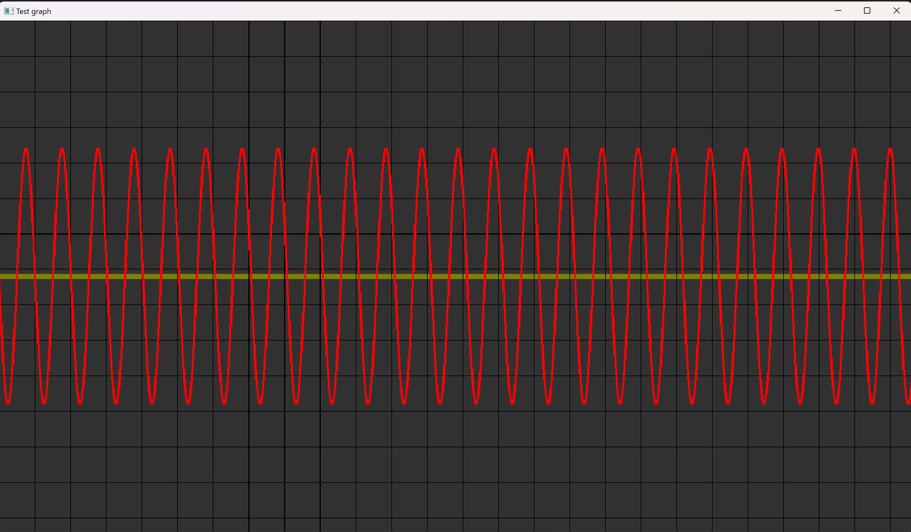
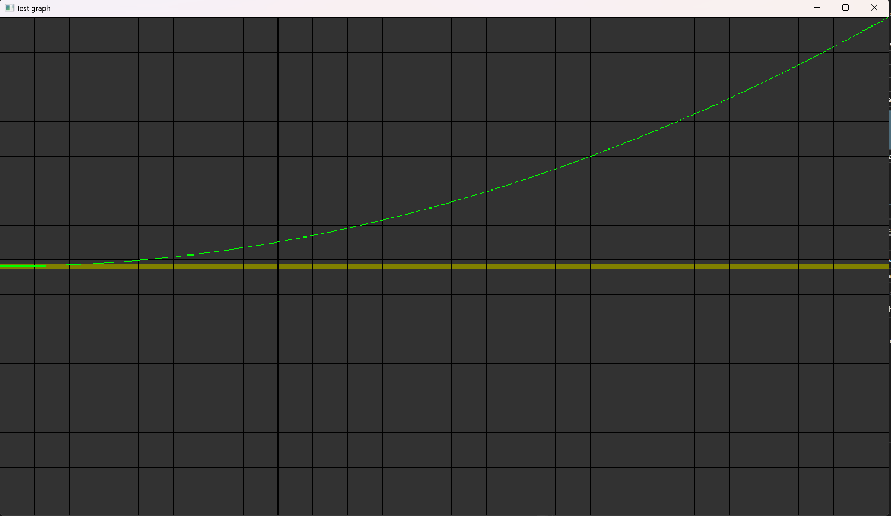
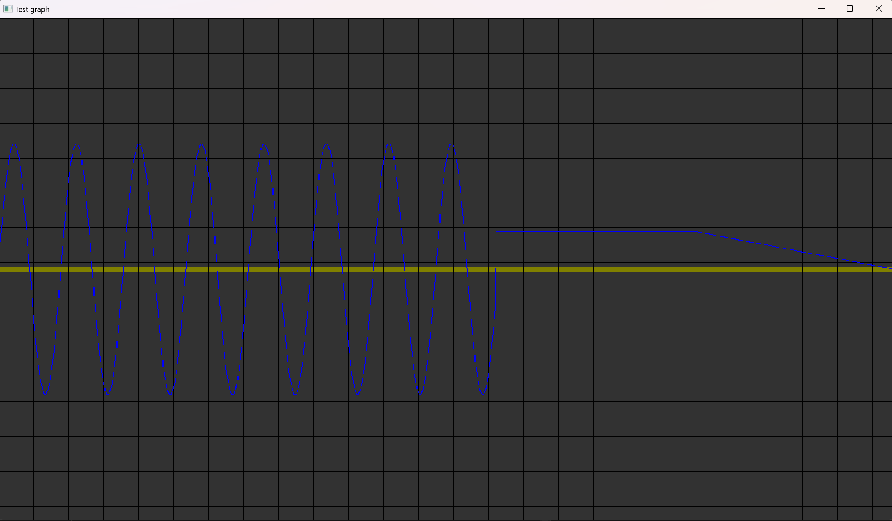
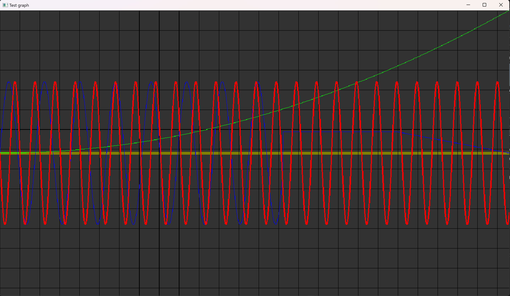

# **PlotOpenCv C++ library**

**v1.1.0**


# Table of contents

- [Overview](#overview)
- [Versions](#versions)
- [Library files](#library-files)
- [plot class description](#plot-class-description)
  - [Class declaration](#class-declaration)
  - [addPlot (1D) method](#addplot-for-1d-dataset-method)
  - [addPlot (2D) method](#addplot-for-2d-dataset-method)
  - [clean method](#show-method)
  - [show method](#clean-method)
- [Example](#example)
- [Build and connect to your project](#build-and-connect-to-your-project)


# Overview

**PlotOpenCv** C++ library provides the visualization of 2-dimensional line charts. This library is built upon the OpenCV, providing users with a convenient and efficient tool for visualizing data through line charts. With **PlotOpenCv**, users can create multiple line charts within a single window and tune various chart parameters, such as line width, color, and more. It utilizes C++17 standard. The library is licensed under the Apache 2.0 license.


# Versions

**Table 1** - Library versions.

| Version | Release date | What's new                                                   |
| ------- | ------------ | ------------------------------------------------------------ |
| 1.0.0   | 08.09.2023   | First version.                                               |
| 1.0.1   | 18.09.2023   | - Update used container for plots.                           |
| 1.0.2   | 16.04.2024   | - Antialiased line drawing implemented.<br/>- Window size issue fixed.<br/>- Documentation updated. |
| 1.0.3   | 17.05.2024   | - Documentation updated.                                     |
| 1.1.0   | 19.07.2024   | - CMake structure updated.<br />- Files renamed.             |


# Library files

The library is supplied only by source code. The user is given a set of files in the form of a CMake project (repository). The repository structure is shown below:

```xml
CMakeLists.txt -------------- Main CMake file of the library.
src ------------------------- Library source code folder.
    CMakeLists.txt ---------- CMake file of the library.
    PlotOpenCv.h ------------ Main library header file.
    PlotOpenCvVersion.h ----- Header file with library version.
    PlotOpenCvVersion.h.in -- File for CMake to generate version header.
    PlotOpenCv.cpp ---------- C++ implementation file.
test ------------------------ Folder for test application.
    CMakeLists.txt ---------- CMake file of test application.
    main.cpp ---------------- Source code of test application.
```


# Plot class description


## Class declaration

**Plot** class declared in **PlotOpenCv.h** file. Class declaration:

```cpp
namespace cr
{
namespace utils
{
/// plot class.
class Plot
{
public:

    /// Get string of current library version.
    static std::string getVersion();

    /// Class constructor.
    Plot(std::string name, int width = 1280, int height = 720, 
         cv::Scalar backgroundColor = cv::Scalar(255, 255, 255),
         cv::Scalar scaleLineColor = cv::Scalar(0, 128, 128));

    /// Class destructor.
    ~Plot();

    /// Render plots on window.
    template <typename T>
    void addPlot(std::vector<T>& points, int id, int start = 0, int end = 0,
                cv::Scalar color = cv::Scalar(255, 255, 255), int thickness = 1);
    /// Method to render plots on window.
    template <typename T>
    void addPlot(std::vector<std::vector<T>>& points, int id, 
                int start = 0, int end = 0,
                cv::Scalar color = cv::Scalar(255, 255, 255), int thickness = 1);

    /// Method to clean window.
    void clean();

    /// Method to show window.
    void show();
};
}
}
```


## getVersion method

The **getVersion()** method returns string of current version of **PlotOpenCv**. Method declaration:

```cpp
static std::string getVersion();
```

Method can be used without **PlotOpenCv** class instance:

```cpp
std::cout << "PlotOpenCv class version: " << PlotOpenCv::getVersion();
```

Console output:

```bash
PlotOpenCv class version: 1.1.0
```


## addPlot (for 1D dataset) method

The **addPlot(...)** method serves the purpose of incorporating a new line chart into the existing window. It either introduces a new plot if the provided id is not yet present, or updates an existing plot associated with the given identifier. Method declaration:

```cpp
void addPlot(std::vector<T> &points, int id, int start = 0, int end = 0,
            cv::Scalar color = cv::Scalar(255, 255, 255), int thickness = 1);
```

| Parameter | Value                                                        |
| --------- | ------------------------------------------------------------ |
| Points    | One dimensional vector which includes vertical points.Vector format : {y1, y2, ... }  |
| id        | Identifier for chart on a window. Provides user to update a chart or add new one.  |
| start     | Start index of plot from vector when user wants to plot a specific range from a dataset. Should be 0 for whole dataset.|
| end       | End index of plot from vector when user wants to plot a specific range from a dataset. Should be 0 for whole dataset. |
| color     | Color of chart line.                                         |
| thickness | Thickness of chart line.                                     |


## addPlot (for 2D dataset) method

The **addPlot(...)** method serves the purpose of incorporating a new line chart into the existing window. It either introduces a new plot if the provided id is not yet present, or updates an existing plot associated with the given identifier. Method declaration:

```cpp
void addPlot(std::vector<std::vector<T>> &points, int id, int start = 0, int end = 0,
            cv::Scalar color = cv::Scalar(255, 255, 255), int thickness = 1);
```

| Parameter | Value                                                        |
| --------- | ------------------------------------------------------------ |
| Points    | Two dimensional vector which includes vertical and horizontal points. Vector format:[{x1,y1}, {x2,y2}, ... ] |
| id        | Identifier for chart on a window. Provides user to update a chart or add new one. |
| start     | Start index of plot from vector when user wants to plot a specific range from a dataset. Should be 0 for whole dataset. |
| end       | End index of plot from vector when user wants to plot a specific range from a dataset. Should be 0 for whole dataset. |
| color     | Color of chart line.                                         |
| thickness | Thickness of chart line.                                     |

**Table 2** - Supported data types.

| Supported data types |
| ---------------------| 
| unsigned char        |
| char                 |
| unsigned int         |
| unsigned short       |
| short int            |
| int                  |
| float                |
| double               |


## show method

The **show()** method is responsible for displaying a window containing all the plotted line charts. Method declaration:

```cpp
void show();
```


## clean method

The **clean()** method is responsible for cleaning a window containing all the plotted line charts. Method declaration:

```cpp
void clean();
```


# Build and connect to your project

Typical commands to build **PlotOpenCv** library:

```bash
cd PlotOpenCv
mkdir build
cd build
cmake ..
make
```

If you want connect **PlotOpenCv** library to your CMake project as source code you can make follow. For example, if your repository has structure:

```bash
CMakeLists.txt
src
    CMakeList.txt
    yourLib.h
    yourLib.cpp
```

create folder **3rdparty** in your repository and copy **PlotOpenCv** repository folder there. New structure of your repository:

```bash
CMakeLists.txt
src
    CMakeList.txt
    yourLib.h
    yourLib.cpp
3rdparty
    PlotOpenCv
```

Create CMakeLists.txt file in **3rdparty** folder. CMakeLists.txt should contain:

```cmake
cmake_minimum_required(VERSION 3.13)

################################################################################
## 3RD-PARTY
## dependencies for the project
################################################################################
project(3rdparty LANGUAGES CXX)

################################################################################
## SETTINGS
## basic 3rd-party settings before use
################################################################################
# To inherit the top-level architecture when the project is used as a submodule.
SET(PARENT ${PARENT}_YOUR_PROJECT_3RDPARTY)
# Disable self-overwriting of parameters inside included subdirectories.
SET(${PARENT}_SUBMODULE_CACHE_OVERWRITE OFF CACHE BOOL "" FORCE)

################################################################################
## CONFIGURATION
## 3rd-party submodules configuration
################################################################################
SET(${PARENT}_SUBMODULE_PLOT_OPENCV                     ON  CACHE BOOL "" FORCE)
if (${PARENT}_SUBMODULE_PLOT_OPENCV)
    SET(${PARENT}_PLOT_OPENCV                           ON  CACHE BOOL "" FORCE)
    SET(${PARENT}_PLOT_OPENCV_TEST                      OFF CACHE BOOL "" FORCE)
endif()

################################################################################
## INCLUDING SUBDIRECTORIES
## Adding subdirectories according to the 3rd-party configuration
################################################################################
if (${PARENT}_SUBMODULE_PLOT_OPENCV)
    add_subdirectory(PlotOpenCv)
endif()
```

File **3rdparty/CMakeLists.txt** adds folder **PlotOpenCv** to your project and excludes test applications from compiling (by default test applications and example excluded from compiling if **PlotOpenCv** included as sub-repository).The new structure of your repository:

```bash
CMakeLists.txt
src
    CMakeList.txt
    yourLib.h
    yourLib.cpp
3rdparty
    CMakeLists.txt
    PlotOpenCv
```

Next you need include folder 3rdparty in main **CMakeLists.txt** file of your repository. Add string at the end of your main **CMakeLists.txt**:

```cmake
add_subdirectory(3rdparty)
```

Next you have to include PlotOpenCv library in your **src/CMakeLists.txt** file:

```cmake
target_link_libraries(${PROJECT_NAME} PlotOpenCv)
```

Done!

# Example

The example demonstrates how to use **PlotOpenCv** library. 

```cpp
#include <vector>
#include <opencv2/opencv.hpp>
#include <opencv2/highgui.hpp>
#include "PlotOpenCv.h"

int main()
{    
	plot graph("Test graph", 1280, 720,cv::Scalar(0, 128, 128) cv::Scalar(50, 50, 50));

    std::vector<float> linePoints(9000);
    std::vector<std::vector<float>> linePoints2(5000, std::vector<float>(2));

    graph.addPlot(linePoints,0, 0, 0, cv::Scalar(255,0,0), 5);
    graph.addPlot(linePoints2,1, 0, 0, cv::Scalar(0,255,0), 2);

    graph.show();
    cv::waitKey(0);
    return 0;
}
```


# Example Charts

Example charts shows what visual effects user should expect depending on input data.




